# ReactJS Basics & Core Concepts

---

## 1. Introduction to ReactJS

- **ReactJS** is a JavaScript Library.
- A **Library** is a JS file which contains predefined functions, objects, and classes.
- **Purpose of React:** To create or build user interfaces (UI).
- Most demanded library in the world to develop user interfaces.
- **Developer & Maintainer:** Developed and maintained by Meta (Facebook).

---

### Why do we have to learn ReactJS?

- ReactJS is the most popular library in the world to create UIs.
- It is simple and easy to learn.
- It provides many inbuilt features to create optimized, high-performance Single Page Applications (SPA).
- It has a rich ecosystem like Redux, Tailwind CSS, React Router, Axios, etc.
- It has very big community support and is backed by Meta.

---

### How to create a Frontend Application with ReactJS?

Generally, React is meant for creating user interfaces; we cannot create a complete frontend application with React alone, but there is a way.

To create a full frontend application with React, we combine or integrate other libraries like:

- **Redux** — for state management
- **Axios** — for API integration
- **React Router** — for routing in ReactJS
- **React DOM** — for managing DOM manipulation
- **Tailwind CSS or Bootstrap** — for styling the UI components
- **Jest** — for Unit testing

---

## 2. JSX (JavaScript and XML)

To create User Interfaces in React, we have to understand the concept of **JSX**.

- **JSX** is a syntax that allows us to create UI elements or components in JavaScript using HTML-like code.
- Without JSX, writing UI in React is hard to read and confusing.
- JSX makes code easy to read and easy to write, similar to HTML which developers already know.
- **JSX is not HTML.** JSX is converted into standard JavaScript by the Babel Compiler before running in the browser.

### Sample HTML File (`UI_Element.html`)

```html
<!DOCTYPE html>
<html lang="en">
<head>
    <title>Document</title>
    <!-- Integration of React -->
    <script src="https://unpkg.com/react@18/umd/react.development.js"></script>
    <!-- Integration of React DOM -->
    <script src="https://unpkg.com/react-dom@18/umd/react-dom.development.js"></script> 
    <!-- Integration of Babel to transpile JSX -->
    <script src="https://unpkg.com/@babel/standalone/babel.min.js"></script>
</head>
<body>
<script type="text/babel">
    // text/babel is used to indicate that the script contains JSX code that needs to be transpiled by Babel
    // JSX code to create a React button element
    var button = <button>React Button</button>;
    // Rendering the button element to the DOM
    ReactDOM.render(button, document.querySelector("body"));
</script>
</body>
</html>
```

#### Output:
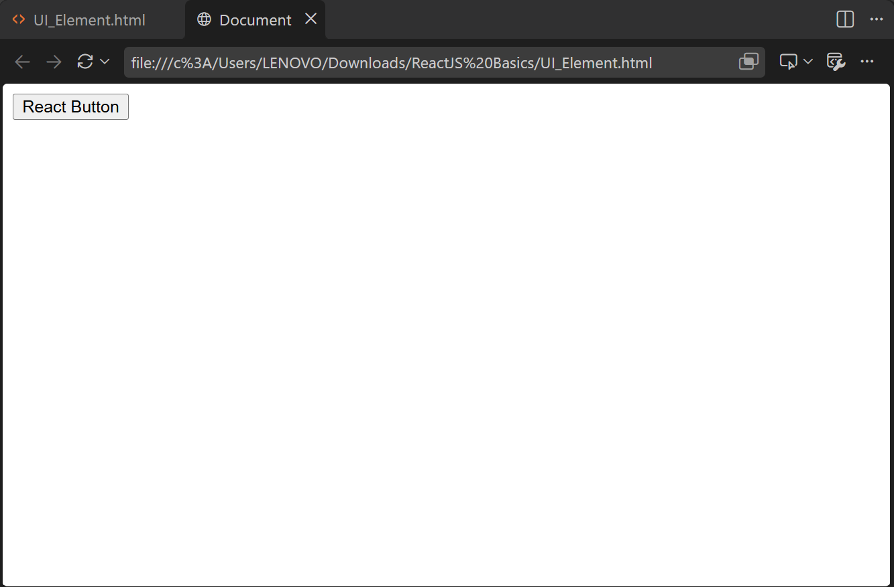

---

## 3. How to Create a React Application

We just learned to create a simple button element using JSX and React, but that is just creating UI elements. We do not want to stick with creating only UI elements. We want to create a full frontend application in which we can create UI, style the UI, perform API integration, handle data management, data validations, routing, and many other things. For that, we have to use a build tool called **Vite**.

### Vite Build Tool

**Vite** (pronounced *'veet'*) is a modern build tool used to create and run front-end applications like React, Vue, Svelte, etc. It helps us manage the React application by providing an internal development server.

We run the following command to create a project with Vite (make sure Node.js is installed on your system first):

```bash
npm create vite@latest my-first-react-ecomm-app
```

#### Command Logs:

```text
C:\Users\LENOVO\Downloads\ReactJS Basics>npm create vite@latest my-first-react-ecomm-app

> npx
> create-vite my-first-react-ecomm-app

|
o  Select a framework:
|  React
|
o  Select a variant:
|  JavaScript
|
o  Which linter to use?
|  ESLint
|
o  Install with npm and start now?
|  Yes
|
o  Scaffolding project in C:\Users\LENOVO\Downloads\ReactJS Basics\my-first-react-ecomm-app...
|
o  Installing dependencies with npm...

added 143 packages, and audited 144 packages in 10s

31 packages are looking for funding
  run `npm fund` for details

found 0 vulnerabilities
|
o  Starting dev server...

> my-first-react-ecomm-app@0.0.0 dev
> vite


  VITE v8.3.1  ready in 603 ms

  ➜  Local:   http://localhost:5173/
  ➜  Network: use --host to expose
  ➜  press h + enter to show help
```

#### Output:
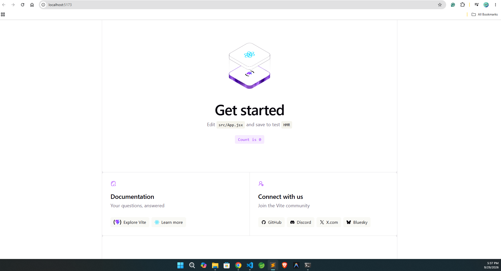

### Project Directory Explanation

- `node_modules` — A collection of installed libraries and dependencies.
- `src` — The main working directory where all components and code will be written.
- `index.html` — The single HTML file present in the application.
- `package-lock.json` — Contains exact dependency tree information for modules inside `node_modules`.
- `package.json` — Contains project metadata, dependencies, and scripts.
- `vite.config.js` — Configuration file for the Vite build tool.

---

## 4. Component in ReactJS

A **component** is a specific, reusable part of the user interface that represents how a piece of the app looks and behaves. A component can be a single UI element or a combination of multiple elements.

There are two types of Components:
1. **Functional Component**
2. **Class Component** *(Outdated in the market)*

### Functional Component

Whenever we have a requirement to reuse JSX or to pass dynamic data to that JSX code, we go for a functional component.

- A **Functional Component** is a JavaScript function that starts with a capital letter, takes `props` as input, and returns JSX.
- They are easy to write and understand because they use less code than class components.
- Functional Components support **Hooks**, which are the preferred and modern way to build React applications.

---

### How to Create a Component

1. Create a folder named `components` under `src`. This will be the master folder where all components reside.
2. For each new component, create a dedicated folder and a JSX file. For example, for a Header component, create a folder named `header` under `src/components/` and a file named `Header.jsx` inside `src/components/header/`.
3. Whatever component we create must be exported so it can be imported and rendered in other files.

> [!IMPORTANT]
> Remove the default code from `index.css` before running the application.

#### Example 1: Header and Footer Components

**Content of `Header.jsx`:**
```jsx
function Header(props){
    return (<div>
        <h1>Header Component</h1>
    </div>);
}

export default Header;
```

**Content of `Footer.jsx`:**
```jsx
function Footer(props){
    return (<div>
        <h1>Footer Component</h1>
    </div>);
}

export default Footer;
```

**Content of `App.jsx`:**
```jsx
import Header from "./components/header/Header";
import Footer from "./components/footer/Footer";

function App(props){
 return (<div>
  <Header />
  <Footer />
 </div>); 
}

export default App;
```

#### Output:
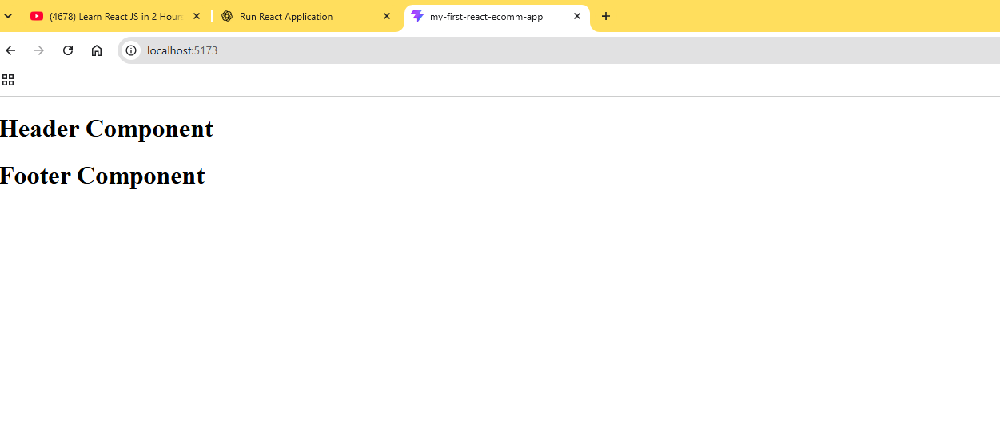

---

#### Example 2: Adding a Main Component with CSS

**Content of `Main.jsx`:**
```jsx
import "./Main.css";

function Main(props) {
    return (<div>
        <p className="main">
            Lorem Ipsum is simply dummy text of the printing and typesetting industry. Lorem Ipsum has been the industry's standard dummy text ever since 1966, when designers at Letraset and James Mosley, the librarian at St Bride Printing Library in London, took a 1914 Cicero translation and scrambled it to make dummy text for Letraset's Body Type sheets. It has survived not only many decades, but also the leap into electronic typesetting, remaining essentially unchanged. It was popularised thanks to these sheets and more recently with desktop publishing software like Aldus PageMaker and Microsoft Word including versions of Lorem Ipsum.
        </p>
    </div>);
}

export default Main;
```

**Content of `Main.css`:**
```css
.main {
    color: green;
    background-color: black;
    padding: 20px;
}
```

**Content of `App.jsx`:**
```jsx
import Header from "./components/header/Header";
import Footer from "./components/footer/Footer";
import Main from "./components/main/Main";

function App(props){
 return (<div>
  <Header />
  <Main />
  <Footer />
 </div>); 
}

export default App;
```

#### Output:
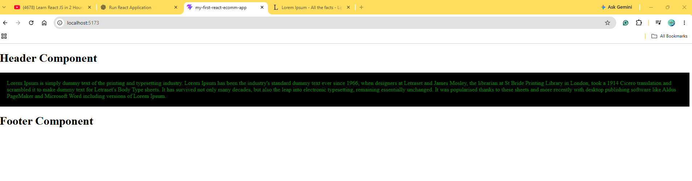

---

## 5. Creating a Simple Card using Functional Component

**Project Directory:** `reactjs-02-card-using-func-component`

**Content of `Card.jsx`:**
```jsx
import "./Card.css";

function Card(props) {
    return (<div className="card">
        
        <h2>Rajiv Shukla</h2>
        <p>Lorem Ipsum is simply dummy text of the printing and typesetting industry.</p>
        <button>Profile Details</button>
    </div>);
}

export default Card;
```

**Content of `Card.css`:**
```css
.card {
    width: 280px;
    height: 420px;
    box-shadow: 0 0 10px black;
    margin: 50 px;
    text-align: center;
}

.card h2 {
    color: green;
}

.card p {
    font-style: italic;
}

.card button {
    padding: 15px 30px;
    border: none;
    background-color: green;
    color: white;
    border-radius: 10 px;
}
```

**Content of `App.jsx`:**
```jsx
import Card from "./components/card/Card";
import "./App.css";

function App() {
    return (<div className="app">
        <Card />
        <Card />
        <Card />
        <Card />
    </div>);
}

export default App;
```

**Content of `App.css`:**
```css
.app {
  display: flex;
  justify-content: space-evenly;
  flex-wrap: wrap;
}
```

#### Output:
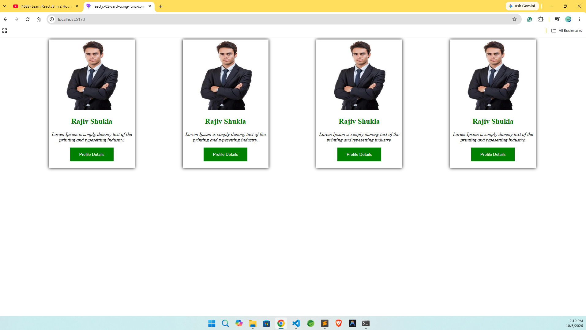

---

## 6. How to Make a Component Dynamic (Props)

**Project Directory:** `reactjs-03-how-to-make-a-component-dynamic`

To make components dynamic, we use the concept of **props**.

- **Props** is input data that we pass to components.
- When rendering a component in tag format, arguments are passed in attribute format.

> [!NOTE]
> When rendering the same component multiple times, make sure attribute key names are identical while values can differ.

- A prop is a property of a component used to pass input data.

**Content of `App.jsx`:**
```jsx
import Card from "./components/card/Card";
import "./App.css";

function App() {
    return (<div className="app">
        <Card name="Dhandapani Sudhakar" imageUrl="https://static.vecteezy.com/system/resources/thumbnails/057/936/076/small/confident-businessman-smiling-with-arms-crossed-conveying-professionalism-and-success-photo.jpg" />
        <Card name="Velmurugan Gugan" imageUrl="https://img.magnific.com/free-photo/ambitious-businessman-standing-street_1262-3451.jpg?semt=ais_hybrid&w=740&q=80" />
        <Card name="Yogesh Ravichandran" imageUrl="https://images.pexels.com/photos/37842959/pexels-photo-37842959.jpeg?cs=srgb&dl=pexels-julien-realtor-2147745923-37842959.jpg&fm=jpg" />
        <Card name="Veerakumar Manivasagam" imageUrl="https://encrypted-tbn0.gstatic.com/images?q=tbn:ANd9GcT9ZKFL0D5uGiEGEPW6dtUnbMaR9d0JO_H9RhzxFo0fkG9WDoI8hvL2uImC&s=10" />
    </div>);
}

export default App;
```

**Content of `Card.jsx`:**
```jsx
import "./Card.css";

function Card(props) {
    // props is an object that contains all the properties passed to the component.
    // In this case, we are using props.name to access the name property passed from the parent component (App.jsx).
    // This allows us to make the Card component dynamic, as it can display different names based on the props it receives.
    return (<div className="card">
        
        <h2>{props.name}</h2>
        <p>Lorem Ipsum is simply dummy text of the printing and typesetting industry.</p>
        <button>Profile Details</button>
    </div>);
}

export default Card;
```

#### Output:


---

## 7. State Concept in ReactJS

**Project Directory:** `reactjs-04-state-concept-in-react`

In React, **state** is a built-in object used to store data or information about the component that can change over time. When component state changes, React automatically re-renders the component to reflect updated data in the UI.

- State is a variable that stores data bound to the UI.
- State automatically updates the UI when its value changes.
- State is created using the `useState` Hook inside a functional component.
- State allows us to make the UI dynamic.

### Creating State (`useState` Hook)

**Basic Syntax:**
```javascript
import React, { useState } from 'react';

const [state, setState] = useState(initialValue);
```

- `state` — the current value of the state.
- `setState` — the function used to update the state.
- `initialValue` — starting value (number, string, boolean, object, array).

**Steps:**
1. Import `useState` Hook:
   ```javascript
   import { useState } from "react";
   ```
2. Call `useState` Hook. It returns an array. We destructure two references:
   ```javascript
   const [count, setCount] = useState(0);
   ```
   The first element is the state variable (`count`), initialized with the default argument (`0`).
3. Access state via the first element of the array.

---

### Practical Example 1: Counter Component

**Content of `Counter.jsx`:**
```jsx
import { useState } from "react";
import "./Counter.css";

function Counter(){
    const [state, setState] = useState(0);

    const increaseCount = ()=> {
        setState(state + 1);
    };

    const decreaseCount = ()=> {
        setState(state - 1);
    };

    return (
        <div style={{ padding: "50px" }}>
            <h1>Count: {state}</h1>
            <button className="increaseBtn" onClick={ increaseCount }>Increase Count</button>
            <button className="decreaseBtn" onClick={ decreaseCount }>Decrease Count</button>
        </div>
    );
}

export default Counter;
```

**Content of `Counter.css`:**
```css
.increaseBtn {
    margin: 10px;
    color: green;
    height: 50px;
    width: 100px;
}

.decreaseBtn {
    margin: 10px;
    color: red;
    height: 50px;
    width: 100px;
}
```

**Content of `App.jsx`:**
```jsx
import Card from "./components/card/Card";
import Counter from "./components/state/Counter";
import "./App.css";

function App() {
    return (<div className="app">
        <Counter />
    </div>);
}

export default App;
```

#### Output 1 (Increase Count):
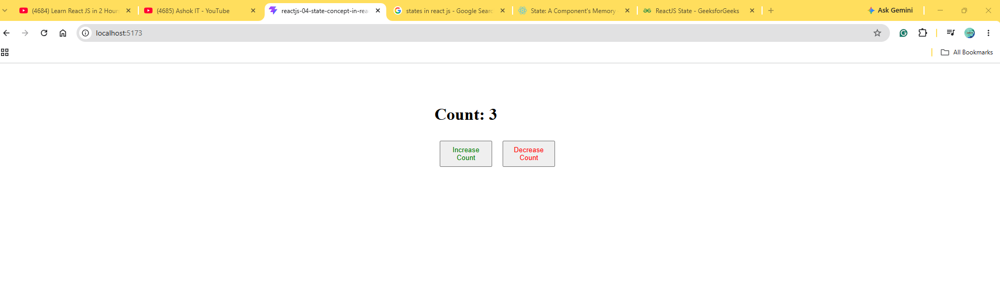

#### Output 2 (Decrease Count):
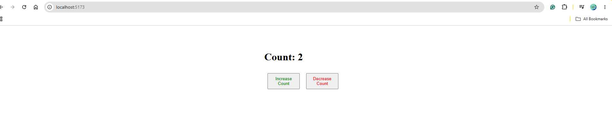

---

### Practical Example 2: Interactive Card State

**Content of `Card.jsx`:**
```jsx
import { useState } from "react";
import "./Card.css";

function Card(props) {
    const [imageUrl, setImageUrl] = useState("https://encrypted-tbn0.gstatic.com/images?q=tbn:ANd9GcSyjH3jOp6Qn4KAL-iJz8nq0J6kpw6cpdtEMUs_cFHfrg&s=10");
    const [name, setName] = useState("Rajiv Gandhi");

    return (<div className="card">
        
        <h2>{name}</h2>
        <p>Lorem Ipsum is simply dummy text of the printing and typesetting industry.</p>
        <button onClick={() => {
            setImageUrl("https://encrypted-tbn0.gstatic.com/images?q=tbn:ANd9GcSyjH3jOp6Qn4KAL-iJz8nq0J6kpw6cpdtEMUs_cFHfrg&s=10");
            setName("Rajiv Gandhi");
        }}>Rajiv</button>
        <button onClick={() => {
            setImageUrl("https://encrypted-tbn0.gstatic.com/images?q=tbn:ANd9GcSP5FkoEXV9skOF6UFHwMX2bYkq8EQUB0XztA6QlWtHTg&s=10");
            setName("Sonia Gandhi");
        }}>Sonia</button>
    </div>);
}

export default Card;
```

**Content of `App.jsx`:**
```jsx
import Card from "./components/card/Card";
import Counter from "./components/state/Counter";
import "./App.css";

function App() {
    return (<div className="app">
        <Counter />
        <Card />
    </div>);
}

export default App;
```

#### Output 1 (Rajiv):
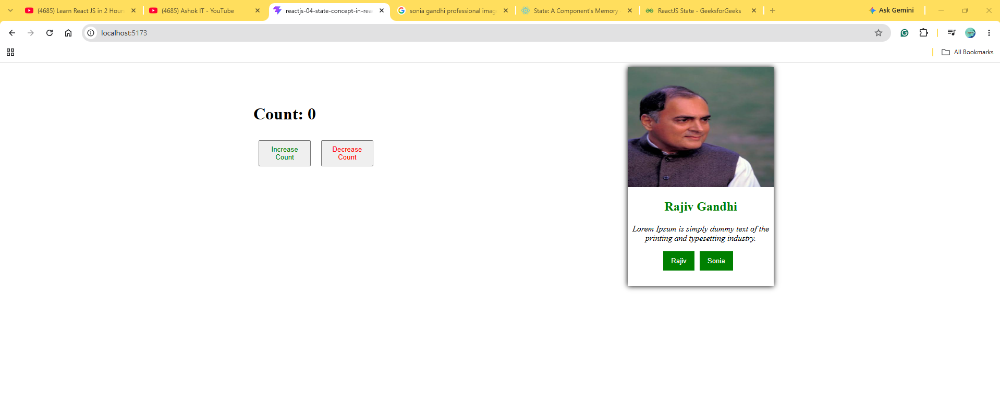

#### Output 2 (Sonia):
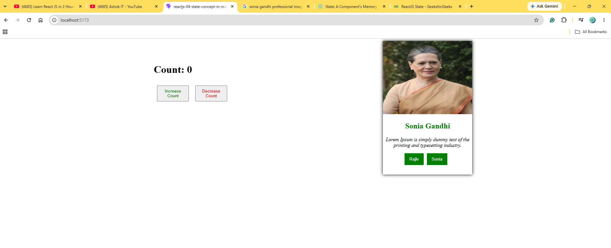

---

## 8. Context API

**Project Directory:** `reactjs-05-context-api`

The React **Context API** is a built-in feature that allows you to share data (like themes, user authentication, or global settings) deeply across a component tree without manually passing props down through every level (a problem known as **"prop drilling"**).

### How Does It Work? The 3 Core Pillars

1. **`createContext`**: Initializes the data store and sets an optional default fallback value / Defines the data store.
2. **`Provider`**: Wraps the parent component tree and broadcasts the data (`value`) down to any children.
3. **`useContext`**: A Hook used by child components to tune into the broadcast and extract data instantly.

---

### Problem with Props (Prop Drilling)

If we have state at the top level (`App.js`) and need it 5 layers down, we must pass that prop through every single intermediate component, even if those middle components don't use the data. This results in cluttered, hard-to-maintain code.

### Difference Between Props and Context API

The main difference between **Props** and **Context API** is how data flows through the application:
- **Props** pass data sequentially down from parent to direct child.
- **Context API** acts as a global broadcast system allowing any component in the tree to access data directly.

> [!TIP]
> - Use **Props** for 90% of your application's UI logic. Explicit data flow makes the codebase predictable and easy to debug.
> - Use **Context API** sparingly for global, low-frequency state updates (themes, user login session, localization). For high-frequency global state, use Redux or Zustand to avoid re-rendering performance bottlenecks.

---

### Steps to Implement Context API

1. Create a Context.
2. Render Provider Component in a Parent Component using context.
3. Consume the Context.

---

### Practical Example

**Content of `context.js`:**
```javascript
import { createContext } from "react";

// Create a context object using the createContext function from React. 
// This context will be used to share data between components without having to pass props down manually at every level.
const myContext = createContext();

// Export the context object so that it can be imported and used in other components.
export default myContext;
```

**Content of `ComponentA.jsx`:**
```jsx
import { useState } from "react";
import ComponentB from "./ComponentB";
import myContext from "./context";

function ComponentA() {
    const [state, setState] = useState("Mallikarjun");
    return (
        <div className="componentAContext">
            <h1>Component A</h1>
            <button onClick={()=>{
                setState("Kharge");
            }}>Mofify</button>
            {/* The myContext.Provider component is used to provide the context value (state) to its child components.
            Any component that is a descendant of this provider can access the context value using the useContext hook. */}
            <myContext.Provider value={state}>
                {/* ComponentB is a child component of ComponentA and will have access to the context value (state) provided by the myContext.Provider. */}
                <ComponentB />
            </myContext.Provider>
        </div>
    );
}

export default ComponentA;
```

**Content of `ComponentB.jsx`:**
```jsx
import ComponentC from "./ComponentC";

function ComponentB(){
    return (
        <div className="componentBContext">
            <h1>Component B</h1>
            <ComponentC />
        </div>
    );
}

export default ComponentB;
```

**Content of `ComponentC.jsx`:**
```jsx
import ComponentD from "./ComponentD";

function ComponentC(){
    return (
        <div className="componentCContext">
            <h1>Component C</h1>
            <ComponentD />
        </div>
    );
}

export default ComponentC;
```

**Content of `ComponentD.jsx`:**
```jsx
import { useContext } from "react";
import myContext from "./context";

function ComponentD(){
    /* The useContext hook is used to access the context value provided by the myContext.Provider in ComponentA.
    It allows ComponentD to consume the context value (state) without having to pass it down through props. */
    const data = useContext(myContext);
    return (
        <div className="componentDContext">
            {/* Display the context value (data) in ComponentD. This value is provided by the myContext.Provider in ComponentA. */}
            <h1>Component D: {data}</h1>
        </div>
    );
}

export default ComponentD;
```

**Content of `App.jsx`:**
```jsx
import ComponentA from "./components/context-api/ComponentA";
import Counter from "./components/state/Counter";
import "./App.css";

function App() {
    return (<div className="app">
        <ComponentA />
    </div>);
}

export default App;
```

**Content of `index.css`:**
```css
.componentAContext{
    width: 1000px;
    padding: 20px;
    box-shadow: 0 0 10px black;
    margin-top: 20px;
}

.componentBContext{
    width: 800px;
    padding: 20px;
    box-shadow: 0 0 10px red;
    margin-top: 20px;
}

.componentCContext{
    width: 600px;
    padding: 20px;
    box-shadow: 0 0 10px blue;
    margin-top: 20px;
}

.componentDContext{
    width: 400px;
    padding: 20px;
    box-shadow: 0 0 10px green;
    margin-top: 20px;
}
```

#### Output 1 (Before clicking on 'Modify'):
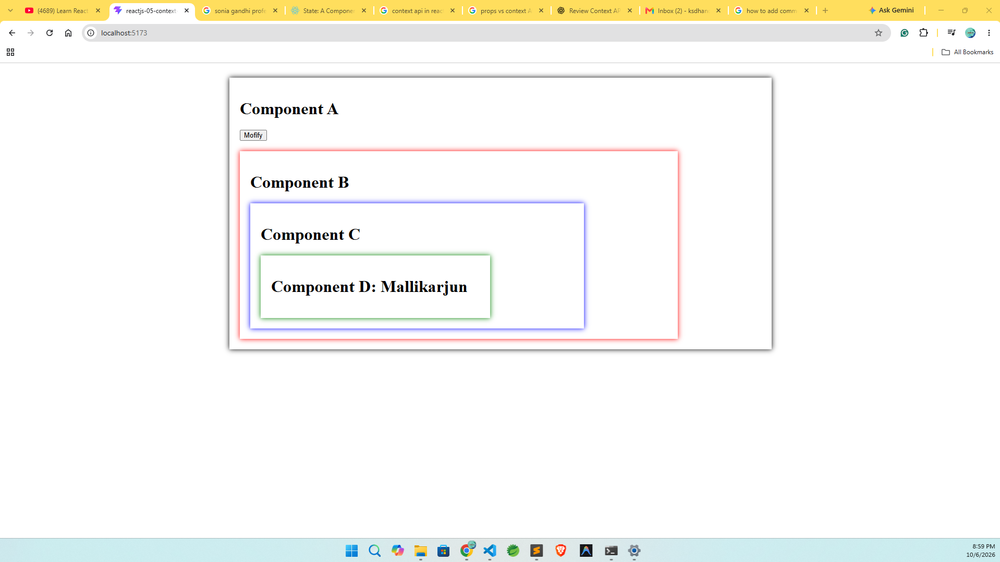

#### Output 2 (After clicking on 'Modify'):
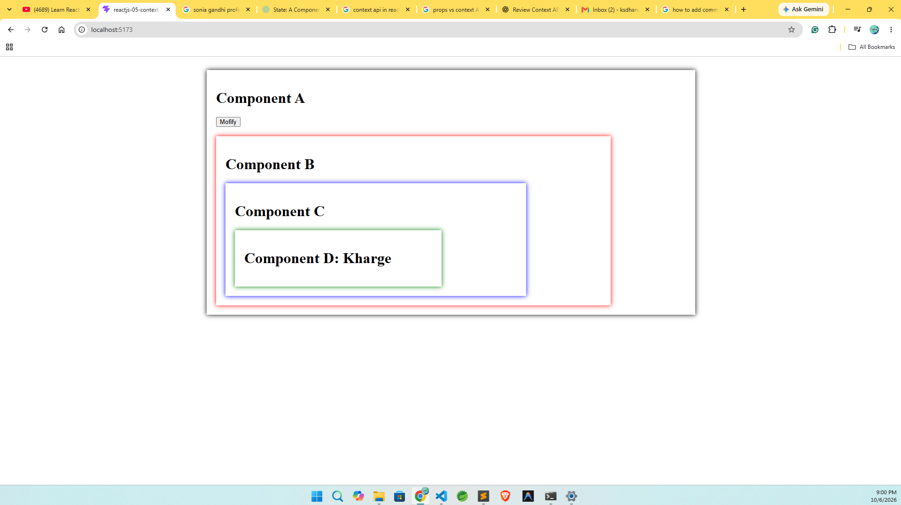

---

## 9. Routing in ReactJS

**Project Directory:** `reactjs-06-routing`

### How to Configure Routing in ReactJS

1. Install package using: `npm install react-router-dom`
2. Wrap App Component inside `BrowserRouter`
3. Configure the Router path for all links
4. Configure the Route for every component
5. Wrap all Route Components inside `Routes` component
6. Replace all Anchor Elements (`<a>`) with `Link` Component

#### Installation Logs:

```text
C:\Users\LENOVO\Downloads\ReactJS Basics\reactjs-06-routing>npm install react-router-dom

added 4 packages, and audited 148 packages in 3s

32 packages are looking for funding
  run `npm fund` for details

1 high severity vulnerability

To address all issues, run:
  npm audit fix

Run `npm audit` for details.
```

**Content of `Main.jsx`:**
```jsx
import { StrictMode } from 'react';
import { createRoot } from 'react-dom/client';
import './index.css';
import App from './App.jsx';
import { BrowserRouter } from "react-router-dom";

createRoot(document.getElementById('root')).render(
  // StrictMode is a tool for highlighting potential problems in an application, here we are using it to wrap the entire application to help identify issues during development.
  <StrictMode>
    {
  /* BrowserRouter is used to enable routing in the application. 
  It wraps the App component, allowing the use of React Router features like Routes and Links within the App.
  */}
    <BrowserRouter>
      <App />
    </BrowserRouter>
  </StrictMode>,
);
```

**Content of `App.jsx`:**
```jsx
import ComponentLink from "./components/context-api/ComponentA";
import Counter from "./components/state/Counter";
import "./App.css";
import Home from "./components/routing/Home";
import Profile from "./components/routing/Profile";
import Product from "./components/routing/Product";
import { Route, Routes, Link } from "react-router-dom";

function App() {
    return (
        <div className="app">
            {/* The Link component is used to create navigation links in the application.
            It allows users to navigate between different routes without reloading the page, providing a seamless user experience. */}
            <Link to="/">Home</Link>
            <Link to="/profile">Profile</Link>
            <Link to="/products">Products</Link>
            <br />
            <br />
            <hr />
            <br />
            <br />
            {/* The Routes component is used to define the routing structure of the application.
            It contains multiple Route components, each specifying a path and the corresponding component to render when that path is matched. */}
            <Routes>
                {/* The Route component defines a specific route in the application.
                It takes a path prop that specifies the URL path and an element prop that specifies the component to render when the path is matched. */}
                <Route path={"/"} element={<Home />} />
                <Route path={"/profile"} element={<Profile />} />
                <Route path={"/products"} element={<Product />} />
            </Routes>
        </div>);
}

export default App;
```

#### Output (Home Route):
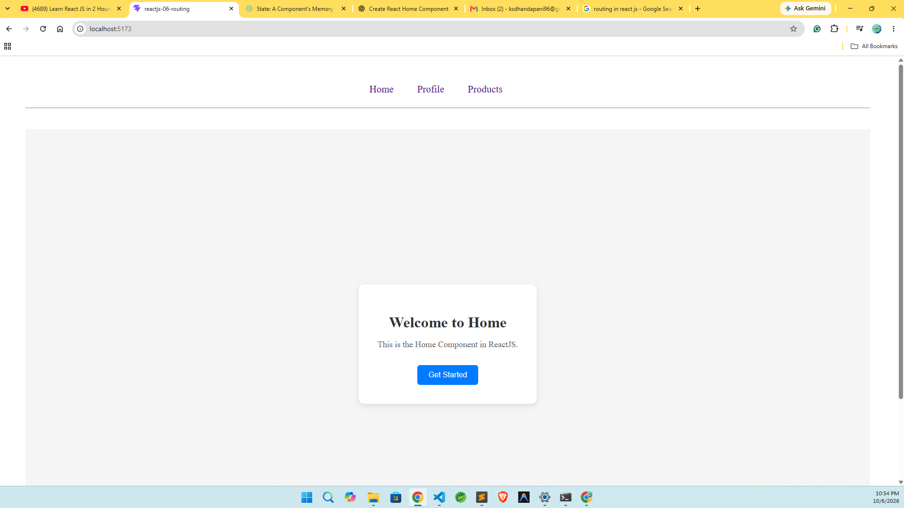

#### Output (Profile Route):
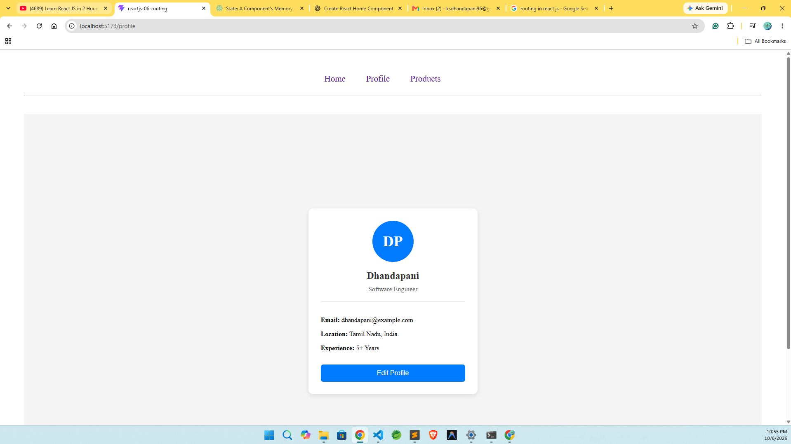

#### Output (Product Route):
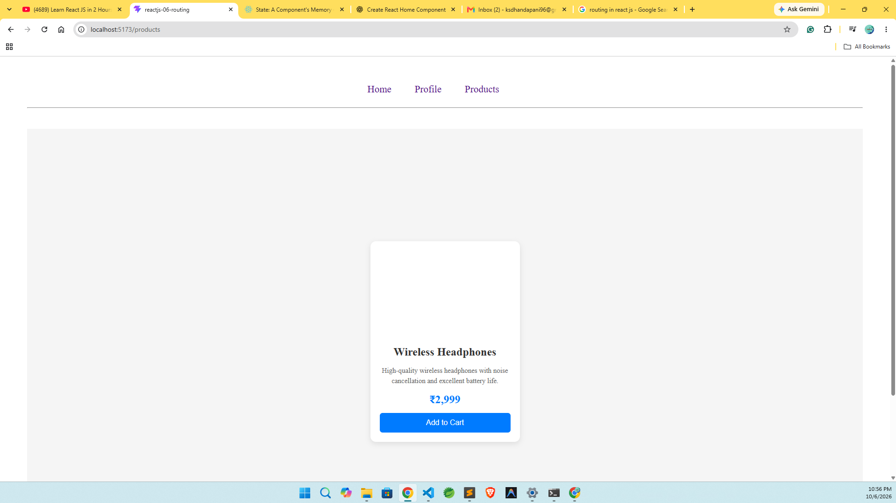

---

## 10. API Integration in React

**Project Directory:** `reactjs-07-api-integration`

If we want to implement API integration in React, we use a library called **Axios**.

### Axios

**Axios** is a Promise-based JavaScript library used for implementing API integration in JavaScript-based applications like React JS, React Native, and Node JS.

- Make `XMLHttpRequest` from the browser
- Make HTTP Requests from node.js
- Supports the Promise API
- Intercept Request and Response
- Cancel Requests

### Installation

Install Axios library using:

```bash
npm install axios
```

#### Installation Logs:

```text
D:\GitHubRepos\react-and-nextjs\ReactJS Basics\reactjs-07-api-integration>npm install axios

added 25 packages, and audited 173 packages in 2s

38 packages are looking for funding
  run `npm fund` for details

found 0 vulnerabilities
```

---

### Practical Example

**Content of `Products.jsx`:**
```jsx
import React from "react";
import axios from "axios";
import { useState } from "react";

// The Products component is responsible for fetching and displaying a list of products from an external API. 
// It uses the useState hook to manage the state of the products array, and axios to make HTTP requests to the API. 
// When the "Get Products" button is clicked, it triggers the getProducts function, which fetches the product data and updates the state accordingly. 
// The component then renders the list of products in a structured format, including their title, description, images, price, and rating.
const productsApiUrl = "https://dummyjson.com/products";

function Products() {

  // The useState hook is used to create a state variable called products, which is initialized as an empty array.
  const [products, setProducts] = useState([]);

  // The getProducts function is responsible for fetching the product data from the API.
  // It uses axios to make a GET request to the specified API URL. 
  // If the request is successful, it updates the products state with the retrieved data. 
  // If there is an error during the request, it displays an alert and logs the error to the console.
  const getProducts = () => {
    axios.get(productsApiUrl).then((response) => {
      console.log(response.data);
      setProducts(response.data.products);
    }).catch((error) => {
      alert("Something went wrong!");
      console.log(error);
    });
  };

  return (<div>
    <h1>Products</h1>
    <p>Lorem ipsum dolor sit amet, consectetur adipiscing elit, sed do eiusmod tempor incididunt ut labore et dolore magna aliqua. Ut enim ad minim veniam, quis nostrud exercitation ullamco laboris nisi ut aliquip ex ea commodo consequat. Duis aute irure dolor in reprehenderit in voluptate velit esse cillum dolore eu fugiat nulla pariatur. Excepteur sint occaecat cupidatat non proident, sunt in culpa qui officia deserunt mollit anim id est laborum.</p>
    <button onClick={getProducts}>Get Products</button>
    {
      // The products.length > 0 condition checks if there are any products in the state.
      // If there are products, it renders a div with the className "products" that contains a list of product cards.
      products.length > 0 && <div className="products">
        {
          // The map function is used to iterate over the products array and render a product card for each product.
          products.map(({ title, description, images, price, rating }) => {
            return <div className="productCard">
              
              <h3>{title}</h3>
              <p>$ {price}</p>
              <p>{description}</p>
              <p>Rating: {rating}</p>
              <button>Prouct Details</button>
            </div>
          })
        }
      </div>
    }
  </div>);
}

export default Products;
```

**Content of `App.jsx`:**
```jsx
import ComponentLink from "./components/context-api/ComponentA";
import Counter from "./components/state/Counter";
import "./App.css";
import Home from "./components/routing/Home";
import Profile from "./components/routing/Profile";
import Products from "./components/routing/Products";
import { Route, Routes, Link } from "react-router-dom";

function App() {
    return (
        <div className="app">
            {/* The Link component is used to create navigation links in the application.
            It allows users to navigate between different routes without reloading the page, providing a seamless user experience. */}
            <Link to="/">Home</Link>
            <Link to="/profile">Profile</Link>
            <Link to="/products">Products</Link>
            <br />
            <br />
            <hr />
            <br />
            <br />
            {/* The Routes component is used to define the routing structure of the application.
            It contains multiple Route components, each specifying a path and the corresponding component to render when that path is matched. */}
            <Routes>
                {/* The Route component defines a specific route in the application.
                It takes a path prop that specifies the URL path and an element prop that specifies the component to render when the path is matched. */}
                <Route path={"/"} element={<Home />} />
                <Route path={"/profile"} element={<Profile />} />
                <Route path={"/products"} element={<Products />} />
            </Routes>
        </div>);
}

export default App;
```

#### Output (Before clicking on "Get Products" button):
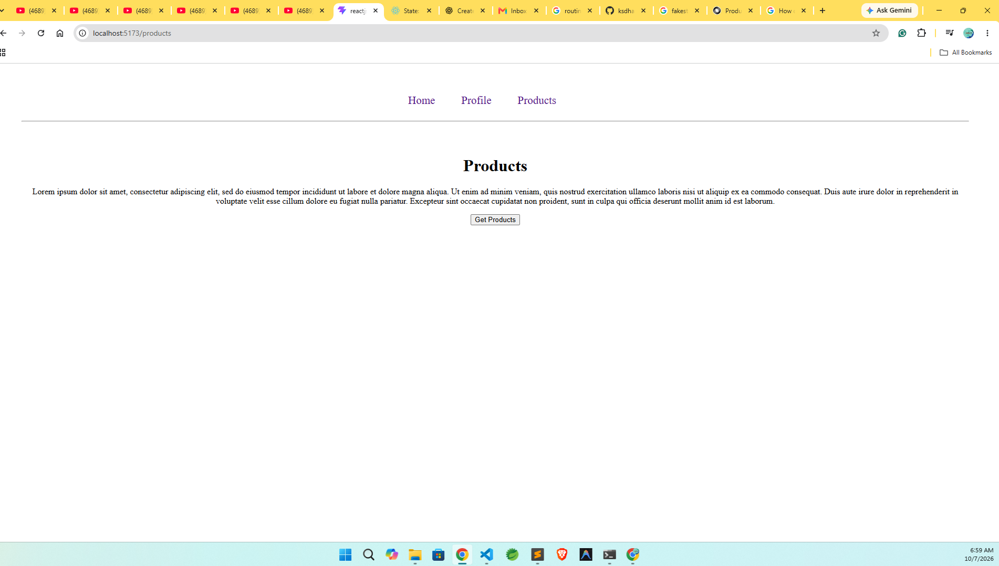

#### Output (After clicking on "Get Products" button):
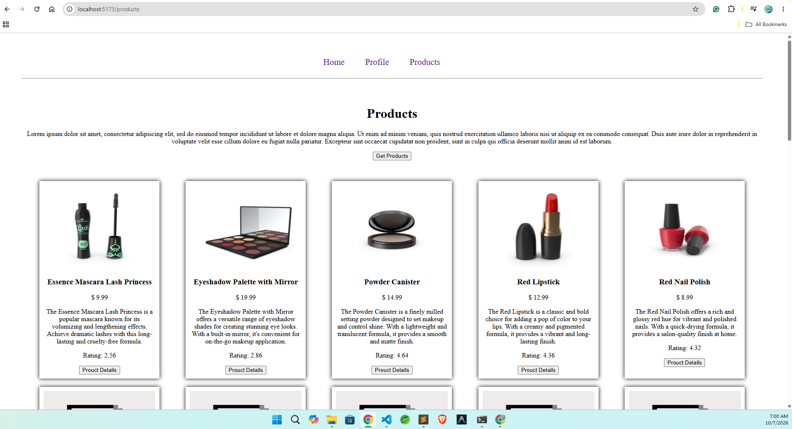
